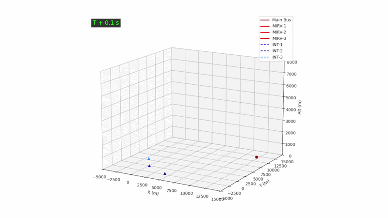

# 3D Ballistic Missile Defense Simulator (SLS-MIRV)

A simple 3D aerospace simulation developed in Python. This code simulates a base strike scenario involving a ballistic missile bus that deploys MIRVs (Multiple Independently-targetable Reentry Vehicles) and a Shoot-Look-Shoot (SLS) defensive salvo of three interceptors.

## Features

### Physics Engine
* **Atmospheric Drag:** Modeling air density ($\rho$) as a function of altitude using an exponential decay model ($1.225 \cdot e^{-h/8500}$).
* **Mass Depletion:** Interceptor acceleration increases dynamically as solid rocket fuel is consumed (The Rocket Equation).
* **Gravity & Ballistics:** Realistic parabolic arcs for all projectiles.

### Tactical Guidance and Logic
* **Proportional Navigation (ProNav):** Interceptors use LOS (Line-of-Sight) rate-based guidance constants ($N=4.5$) to calculate optimal intercept vectors.
* **MIRV Deployment:** At T+14s, the main hostile bus shatters into three independent reentry vehicles with unique spread velocities.
* **Evasive Maneuvers:** Targets perform 15-G terminal "corkscrew" jinks to attempt to break the interceptors' radar lock.

### Sensor Simulation
* **Alpha-Beta Filter:** Interceptors do not have perfect knowledge; they filter 15m of Gaussian radar noise to estimate target position and velocity.
* **VLS Phase:** Vertical Launch System simulation where missiles pop-up to clear silos before engaging guidance.

---

## Visualization
The simulation utilizes **Matplotlib's 3D Toolkit** with a custom interactive UI:
* **Interactive Camera:** Elevation is locked at 15° for stability, while the user can freely rotate the horizontal azimuth during playback.

---

## Prerequisites
* Python 3.x
* NumPy
* Matplotlib
